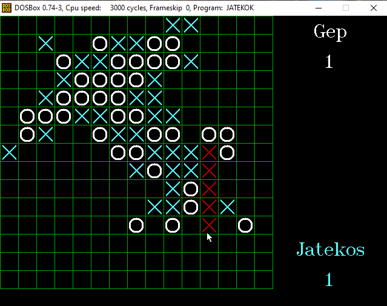
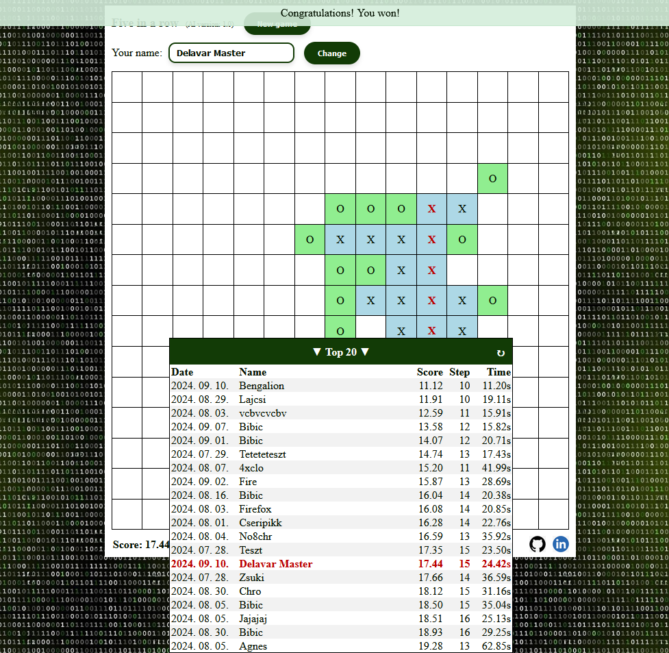
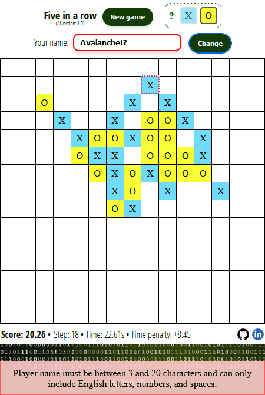
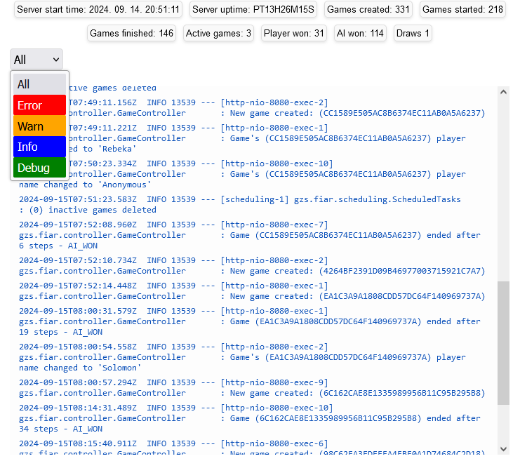

Ezt az amőba játékot szántam bemutatkozó projektnek, ahol is egy 20 évvel ezelőtt készült DOS-os **C++** programomat alakítottam át modern webalkalmazássá (**Java** backend és **Javascript**, **JQuery**, **CSS**, **HTML** frontend technológiák alkalmazásával).

A játékot itt nézheted meg működés közben : **[atomcomci.cloud](https://atomcomci.cloud)** (AWS)

---

### Tervek

Tervben van még az AI kódjának optimalizálása, játékerejének erősítése, és ezzel egyidejűleg a gépi játékos majdani különböző erősségű szintjeihez tartozó külön ranglisták létrehozása. Lehet az aktuális játékok állapotát inkább adatbázisban fogom tárolni, jelenleg ezeknek a minimális memória igénye miatt nem tartom szükségesnek a tartós tár használatát (de demozás szempontjából legalább több lesz a projektben az adatbáziskezelés). A frontend JS/CSS részét is lehetne még optimalizálni, rendbetenni. Ezen felül tesztek írásával is adós vagyok.

### A kódról

A böngészőben játszható amőba REST API alapokra helyezett, Java backenddel kommunikáló webalkalmazás.

Mivel frontend keretrendszert nem ismerek (még), így a HTML, CSS, és Javascript (főképp JQuery) kód mondhatni szövegszerkesztővel készült, bár az IntelliJ fejlesztőkörnyezet sokat segített (a backend is ebben készült). A frontend reszponzív, böngészőből és mobilról egyaránt játszható.

A backend a szokásos controller-service-repository felépítésű, a különböző aktív játékokat egy GameManager nevű komponens fogja össze. Az egyes játékok azonosítására a sessionoket használom, amint a kliens-oldal inaktívvá válik, a hozzá tartozó session lejárta után egy ütemezett komponens kitakarítja az inaktív példányokat a memóriából. Egy statisztikai oldal is van a háttérben.

A gépi játékos régi logikáját teljesen változatlanul hagytam, csak refaktoráltam a Clean Code elvek nyomán.

### A régi

*(A régi C++ forráskód megtalálható az assets mappában. Az idő tájt még nem tudtam mi a Clean Code, így nem is törekedtem erre. Kéretik ilyen szemmel nézni...)*

### Az új

